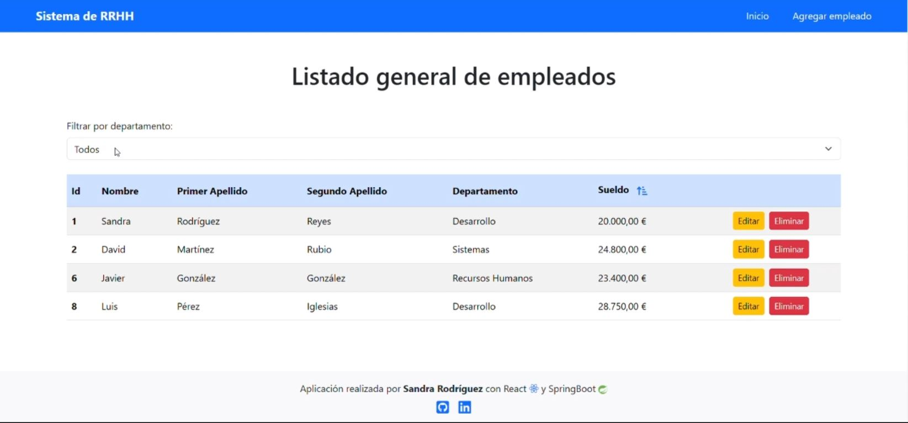

# Sistema de gestión de RRHH (Frontend)

## Descripción

Este es un sistema de gestión de empleados que permite realizar operaciones CRUD (Crear, Leer, Actualizar y Eliminar) sobre los registros de empleados. La aplicación utiliza **React** y **Bootstrap** para el frontend, y **Spring Boot** con **MySQL** para el backend.

## Características

- **Listado de Empleados**: Muestra una lista completa de todos los empleados.
- **Filtrado por Departamento**: Permite filtrar empleados por su departamento correspondiente.
- **Ordenación de Sueldo**: Los empleados pueden ser ordenados por sueldo de forma ascendente o descendente.
- **Agregar Empleado**: Posibilidad de añadir nuevos empleados al sistema.
- **Editar Empleado**: Permite modificar la información de un empleado específico.
- **Eliminar Empleado**: Opción para eliminar un empleado del sistema.

## Tecnologías Utilizadas

- **Frontend**:
  - React
  - Bootstrap
- **Backend**:
  - Spring Boot
  - MySQL

## ✨ Autor

- [GitHub de Sandra](https://github.com/srdgz)
- [LinkedIn de Sandra](https://www.linkedin.com/in/sandra-rodriguez-reyes/)
